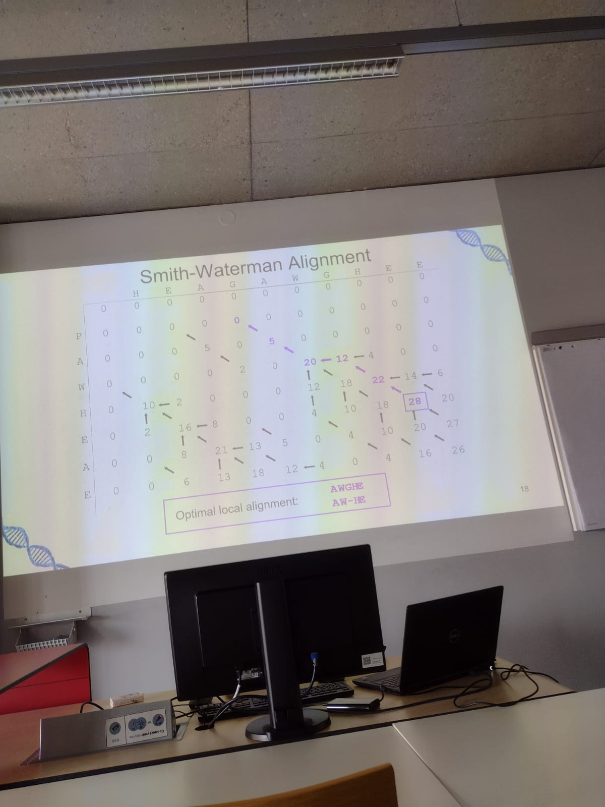
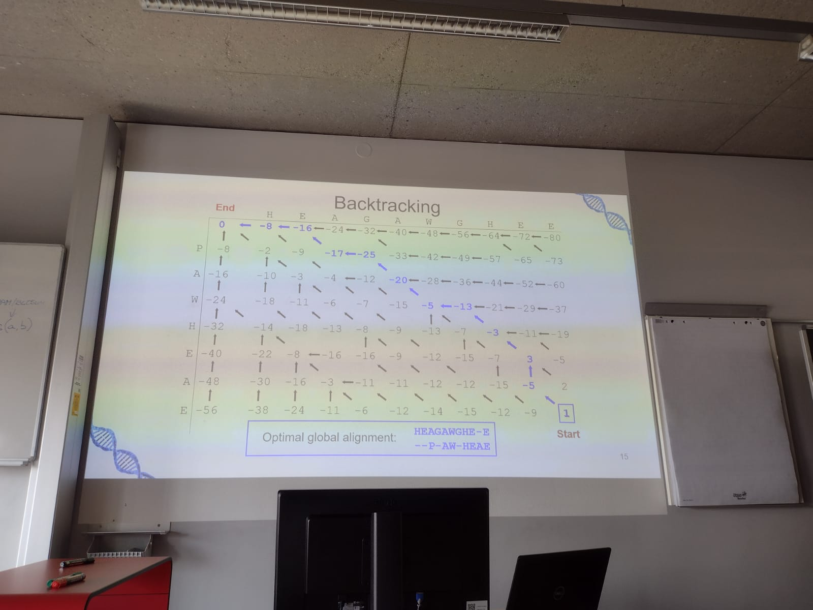
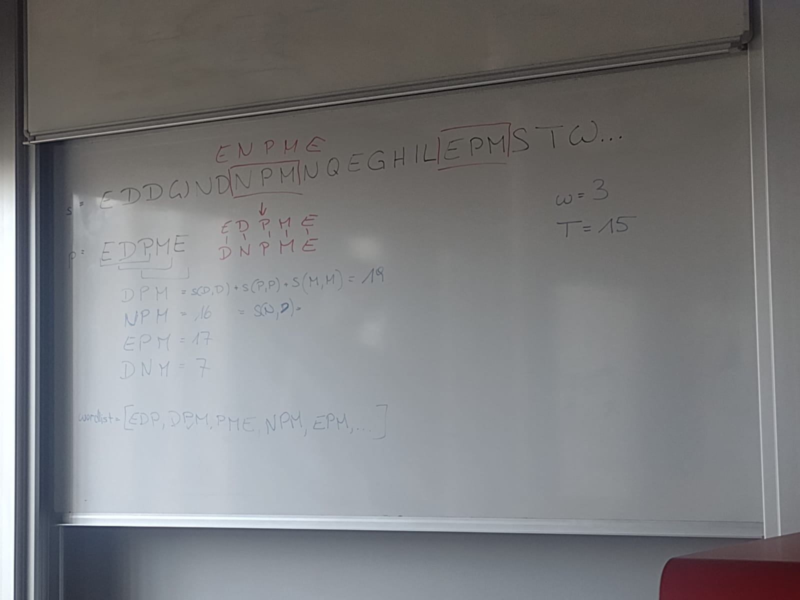

# Similiarity of sequences and sequemnt allignemnt
- What is a match, mismatch, what is a gap

match = 2 nucleotides same
mismatch not
gap = insertion or deltion occured

Requirements for allignement algorithms
- consider gaps, insertation deltion replacemtn and the chemical properties of the proteins
- fast  
- Dynamic programming

Scoring system
- ssubstition and identity matrices
- substitution: 1s in the diagonal

Odd's ration: this is the value how we score an allignment, 
prob that 2 sequences derive from mutation 
or they are not related and are random

- P (A,b | M(muation))
_______________________
 P (A,b | R(random)) 

Use Logarithm: sum of the logs
We use logarithm to make it human and computer readable due to mulitplication of the number below 1 

 Strategy to find if sequences are realted =
 
Position specific scoring matrix

3 types of a matrix

- 1. Count: count each occureance 
- 2. Frequency: each column adds up to 1
- 3. Weight Matrix: ln (Freq/ 0.25 (4 nucleotides )),  sum of all the weight in the matrix is the result, higher than 1 means that it is related

What is concensucs seq: most commonly occured nucleotides

Position independent scoring
- Identity Matrices
- PAMs: They are for amino acids but also contain info about protein
- BLOSUM: 

PAM (Perecent Accepted Mutation)
- use phylogenetic tree to get to a Replacement Matrix and Rleative Frequences  LARGE TRIANGLE 
- 1 PAM is the time period in which 1% of the amino acids mutate

The lower the PAM the closer the sequences
PAM 250 = 20% similiarity
PAM 1 = 99%

Calculate the Score for how good the allignemnt is fo r2 sequences
S1: M A T G L I C
S2: M I T G C L I C

- Make a gap to get a better mach
S1: M A T G  - L I C
S2: M I T G C L I C

score for S1[x] + S2[x]  

## Dynamic Programming
- Needleman-Wunsch
- Smith-Waterman

## Needleman-Wunsch
- d value: 8
- First row and column are 0

__________________________
0  |      -8       | -16 | -24 | -32
-8 | 0 (max) value | 
-16| 
-24|

2 seq allgining 
- longer on X
- shorter on Y

- each move in the matrix is costing you the gap cost on XY axis
- diangonal move is a constant based on the log ods BLosum 62 table (input ins the amino acid M T A .... )
- reulst per box is the max of the 3 inputs coming to it , diagonal only comes from top left

- XY moves only to the right and down
- diagonal moves to the top left

- how to perform the allignemt ,follow the arrows from the bottom right to the top left against the flow 
- backtrack diagonal means both of the amino acids allign
- gaps: on XY axis, gap on the 
    - X means that we go left
    - Y gap means we go up

## Smith - Waterman
- worst case: 0, 4 inputs 
    - X
    - Y
    - Diagonal
    - 0
- unless we have positive diagonal value we will always have 0
- we are looking for the best local allignment the moment we find the first 0 we stop
- The best allignemnet is the highest one still ending with 0

## BAG of words which is built of a combination of W amino acids 
- THe perfromance of each combination with length W is scored on a performance 
- Threshold is set to a positive value, a concept of sliding window calculates the score for each combination of W amino acids
- Adds the combinations which are above the threshold to the bag of words

## BLAST
3 steps
1. Word search: 
    - find the words in the bag of words
    - find the words in the query sequence
    - find the words in the database
2. Scoring
    - find the allignemnt score for each word
    - find the allignemnt score for each word in the database
3. Extension
    - extend the allignemnt to the left and right
    - extend the allignemnt to the left and right in the database
    - find the best allignemnt
Evaluation
- P value: probability that the allignemnt occurs, range 0-1, the higher the better
- E value: expected number of allignemnts in percentage, the higher the better
    
    
- E : formula -> K * m * n * e^(-lambda * S)
- P: formula -> 1 - e^(-lambda * S)
\\\\    `K` = K value for the scoring matrix                                                                                                                                                                                                                                            

RANDOM NOTES
- PAM and BLOSUM are scoring matrices and are both substitution matrices
- all identty matrices are substitution matrices but the other way around 
- higher PAM allows more mutations
- PAM250: 250 mutation in 100 amino acids, PAM1 
- PAM1: 1 mutation in 100 amino acids
- PAM1: 99% similiarity
- PAM250: 20% similiarity

- Sequences
    - Too many gaps = gap is cheap
    - Too little gaps = gap is expensive

- Linear vs affine gap penalty
    - d: gap cost (3)
    - g: gap length (3)
    - e: gap extension (0.1)

    - linear gap cost: matches + (y(g   )) 
    - affine gap cost

3 small questions from the frist
1 large from second