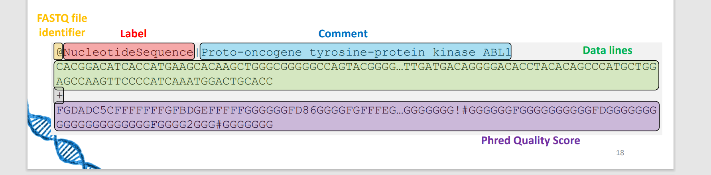
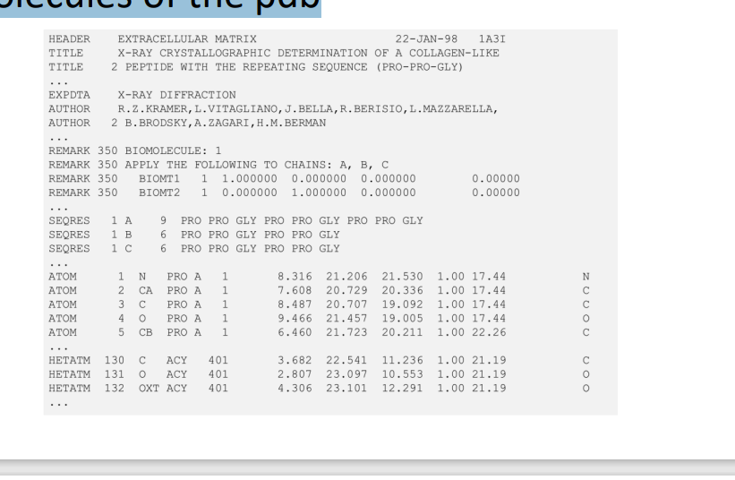

# Algorithms and tools in Bio-Informatics

## Standard Datasets and Formats
1. Fasta
- Nucleotide sequence or amino acid sequence

2. FASTQ
- Nucleotide sequence and quality scores
- Same as fasta but with quality scores (Phred scores)

- Phred score: generated by DNA sequencer, measures the quality of the base call

3. SAM/BAM
- Sequence Alignment/Map
- Binary version of SAM

- Text based format to store sequence alignment data into a reference sequence

4. VCF
- Variant Call Format
- Stores gene sequence variations

5. PDB
- Protein Data Bank format 
- Text based format to store 3D structure of proteins

Overview: 

## Types of Databases
1. Bibliographic
- PubMed
2. Taxonomic
- NCBI Taxonomy
3. Nuceleic Acid 
- GenBank
4. Genome
- GEO 
5. Protein
- PDB

