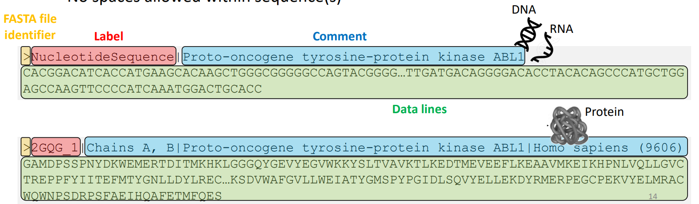
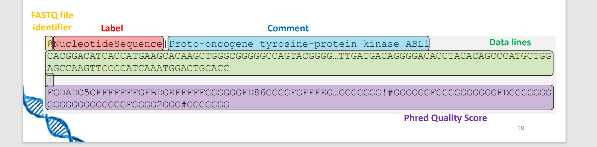
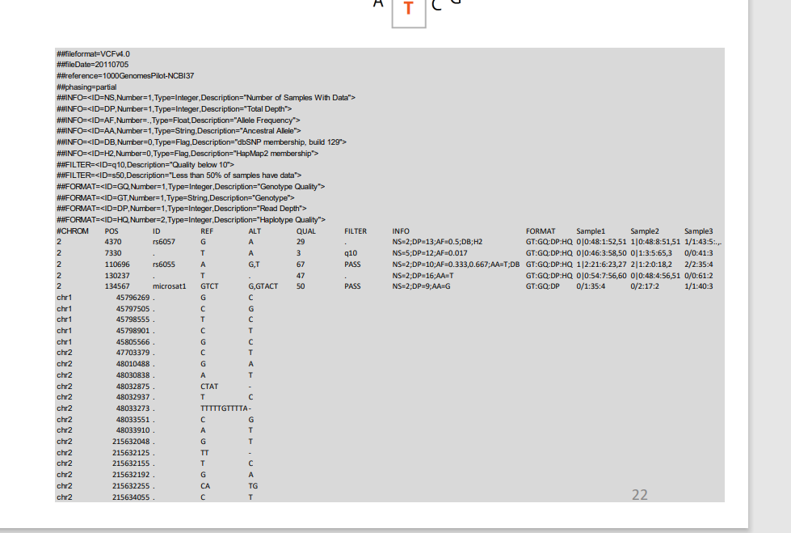
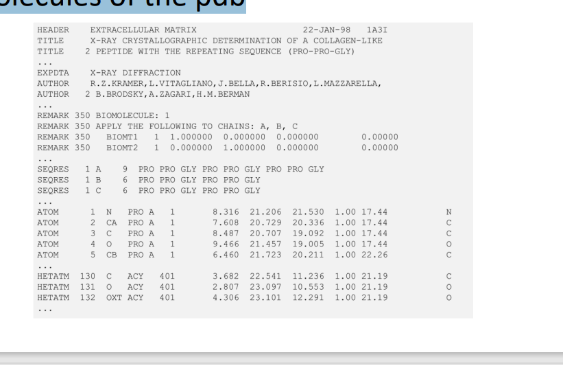
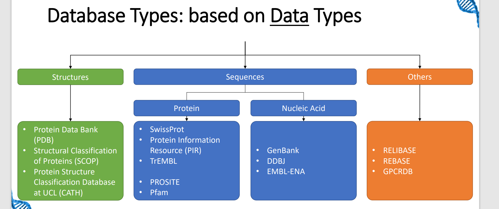

# Algorithms and tools in Bio-Informatics

## Standard Datasets and Formats
1. Fasta
- Nucleotide sequence or amino acid sequence

2. FASTQ
- Nucleotide sequence and quality scores
- Same as fasta but with quality scores (Phred scores)

- Phred score: generated by DNA sequencer, measures the quality of the base cell

3. SAM/BAM
- Sequence Alignment/Map
- Binary version of SAM

- Text based format to store sequence alignment data into a reference sequence

4. VCF
- Variant Call Format
- Stores gene sequence variations

5. PDB
- Protein Data Bank format 
- Text based format to store 3D structure of proteins

Overview: 

## Types of Databases
1. Bibliographic
- PubMed
2. Taxonomic:  genetic heritance
- NCBI Taxonomy
3. Nuceleic Acid 
- GenBank
4. Genome
- GEO 
5. Protein
- PDB

## Primary Databases, Secondary Databases, Composite Databases
- Primary: 
    - GenBank
    - DDBJ
    - EMBL-ENA
- Secondary:
    - UniProt
    - Ensembl
    - OMIM
    - ArrayExpress

- Composite:
    - BioGPS
    - OWL
    
# IMPORTANT

- what is bio inf and why we need
- 5 modern file format ( names just describe) what is in each line 
- how we can group the databasases by source and type (4) pdp,genbank,ddbj 
- know the instiutuce, embl ena and ddbj
- data pre processing and data processing 
- what are primers (Polynucleotide) and what is the use of it = analyze the dna sequence
- ORF: open reading frame = AUG , start till stop codon
- consensus sequence = most frequent nucleotide at each position 
- gene expression = what is the gene expression = amount of RNa in a cell or multiple cells
- ML: why we need what can we do with it, 
- Alfafold = input / output , what it does

# Questions for exam:

1. Definition of Bioinformatics
- subdisciplne of biology and computer science which is interested in storage analysis and processing od biological data: DNA/Amino acids/proteins

2. Why are algorithms required
- Biological Analysis
- Knowledge extraction
- Biological data categorization
- Molecular modelling

3. What are the 5 standard file formats 
- Fasta
- VAR
- VCF
- FASTQ
- SAM/BAM

4. What kind of data is stored in FASTA file format
- Necleotide sequence
- Amino Acid Sequence

5. What is the Phred quality score in FASTQ
- measures the quality of the identification of the nucleobases
- Based on ASCII
- > 30 is good

7. We heard about different databases types, which two main databse types have we talked about based on 
- Source (primary, secondary, composite)
- Data (structure, sequence, other)

8. Primary databases
- PDB
- GenBank
- DDBJ 
- EMBL-ENA

9. Secondary databases
- UniProt Knowledgebase
- Ensembl
- OMIM
- ArrayExpress

10. Composite databases
- BioGPS
- OWL

11. What kind of database would you access if you need information about a specific topic to receive publications
- Bibliographic: PubMed

12. I want to get infromation about species heritance - what kind of database would you recommend
- Taxonomic

14. I want to implement a workflow for the identification of point mutation - where would I get FASTQ data from to provisionally implement such a worfflow before I the real data from our collaboration data
- Nucleic Acid Database

15. I have two primer (forward and reverse) and I want to receive the sequence between these two primers- what tool could I use? WHich instution owns this tool 
- Ensembl/BLAST

16. What kind of database would I acces if I want to receive gene expression data? Do you know tool I could use?
- Genome Database

17. You get a sequence (AA - Amino Acid or NT - Nucleotide) and want to know from what species it derives from - how would you find that out 
- Ensembl/BLAST

18. There are protein database. What kind of sources does the PDP provide.
- 3D structure 
- FASTA files
# TODO
18.  What kind of information does the PFAM provide
# TODO

19. In our gene expression example we saw that different genes/proteins stimulate or inhibit the produciton of other proteins. What kinds of database would you suggest fro analyzing this kinds of influences.
- Protein Families Domains Functionality

20. If I have a DNA sequence and I want to receive the ORF: Open Reading Frame - what tool can I use? Can I extract it manually? 
- ORFfinder

21. What are the steps we need to take if we want to receive the concses sequence from NGS data in FASTQ file format 
    1. Perform Quality check  
    2. Clean Data 
    3. Perform mapping 
    4. Denerate consensus sequence

22. What is the benefit of using Random Forest
- Feature importance
23. What is the best Algorithm for predicting protein structures
- AlphaFond

