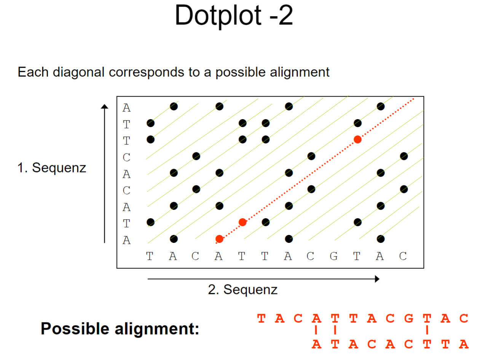
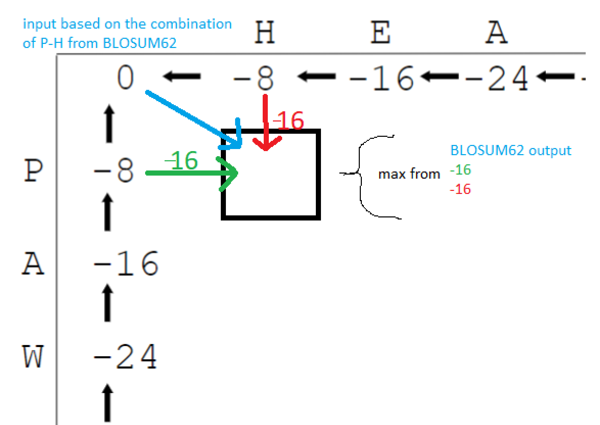

# Part 2: Algorithms and Tools in Bioinformatics


## Motivation
    - Why do we need to compare sequences?
     - The answer is to find out if the sequences are related or not and how much they are related
    
### Sequence Comparison
    - Comparison of nucleotide sequences: 4 nucleotides
    - Comparison of amino acid sequences: 20 amino acids

### Similarity vs Allignment
    - Similarity of two sequences is the measure of how well the sequences match
    - Allignment is the process of overlapping the sequences to find the best match using gaps and mismatches

### Requirements for allignement algorithms
    - consider: (gaps, mismatch and match)
    - fast 
    - Dynamic programming
    - Need to have a scoring system to score the allignemnt


## Similarity of Sequences/ Scoring matrices
    - Types of Scoring matrices
        - Substitution matrices
        - Position specific scoring matrix
            - Count
            - Frequency
            - Weight Matrix
        - Position independent scoring 
            - Identity matrices
            - PAMs
            - BLOSUMs

### Substitution matrices
    - Used by BLAST
    - Used to score the allignemnt
    - 1s in the diagonal
    - The higher the score the better the allignemnt

    - Example
    
    A = AGGACT
    B = GTGAGT

    Table
    +---+---+---+---+---+---+
    |   | A | G | C | T |
    |---|---|---|---|---|
    | A | 1 | 0 | 0 | 0 |
    | G |-2 | 1 | 0 | 0 |
    | T |-2 |-2 | 1 | 0 |
    | C |-2 |-2 |-2 | 1 |
    +---+---+---+---+---+---+

    Result: -2 + (-2) +1 +1 + (-2) +1 = -3 
    Each of the letters are compared to each other and the score is added up based on the table

### Odds Ratio
    - This is the value how we score an allignment
    - prob that 2 sequences derive from mutation 
    - or they are not related and are random

    - P (A,b | M(muation))
    _______________________
     P (A,b | R(random)) 

    - Use Logarithm: sum of the logs
    - We use logarithm to make it human and computer readable due to mulitplication of the number below 1

    
### Position specific scoring matrix
    - 3 different types of matrices

        - Count: count nucleotides in each position in Alligned sequences
        - Frequency: Frequency of each nucleotide in each position, columns add up to 1
        - Weight Matrix: ln (Freq/ 0.25 (4 nucleotides )),  sum of all the weight in the matrix is the result, higher than 1 means that it is related

### Position independent scoring
    - Identity Matrices
        - Diagonal is the same positive number
        - Rest are negative 

    - PAMs: They are for amino acids but also contain info about protein
    - BLOSUM:

### PAM (Perecent Accepted Mutation)
    - The aim to make a model which tell the probability of a mutation 
    - PAM 1: 1 mutation in 100 amino acids
    - PAM 250: 250 mutations in 100 amino acids
    
    - The lower the PAM the closer the sequences
    - PAM 250 = 20% similiarity
    - PAM 1 = 99%

### Blosum
    - Blocks Substitution Matrix
    - It is based on the BLOCKS database
    - It is used to score the allignemnt of protein sequences
    - It is used by BLAST

### Score for Insertion and Deletion
    - Gaps are penalized
    - Too many gaps: gap cost is too little
    - Too few gaps: gap cost is too high

    - Types of gaps
        - Affine gap cost: -gd 
        - Linear gap cost: -d -(g-1) * e

    - Explanation:
        - g: gap length
        - d: gap cost
        - e: gap extension cost

- Example:
```text
d = 3 (gap opening)
e = 0.1 (gap extension)
g = 2 (gap length)


S1:   A T G T T A T A C
        " " " " ? ? 
S2: T A T G T G C G T A T A

" = Alligned
? = to be deleted/inserted


Formula Affine gap cost: -d - (g-1) * e
Result: -3 - (2-1) * 0.1 = -3.1
```

### Methods of Sequence Allignemnt
    - Dynamic Programming
        - Needleman-Wunsch
        - Smith-Waterman
    - Heuristic Methods
        - BLAST
        - FASTA

### Dotplot
    - Used to visualize the similarity of 2 sequences
    - X and Y axis are the sequences
    - The dots are the matches
    - The diagonal line is the best match
    
- 

#### Dotplot with Windowing
- Window size: amount of amino acids to be compared
- Stringency: the amount of matches in the window


## Global/Local Alignments
    - Global: 
        - Allign the whole sequence
        - Needleman-Wunsch
    - Local:
        - Allign the best part of the sequence
        - Smith-Waterman
### Dynamic Programming
    
#### Needleman-Wunsch (global allignment)
    - 0 top top left
    - gap cost: each move on the XY axis is penalized
    - 1st row and column are a multiplication of the gap cost
    - 3 inputs
        - X
        - Y
        - Diagonal
    
    - Example:

- 

#### Smith-Waterman (local allignment)
    - IMPORTANT:
        - worst case: 0
        - the starting point is the largest value
    - 0, 4 inputs
        - X
        - Y
        - Diagonal
        - 0
    - unless we have positive diagonal value we will always have 0
    - we are looking for the best local allignment the moment we find the first 0 we stop
    - The best allignemnet is the highest one still ending with 0

    - SAME CONCEPT AS NEEDLEMAN-WUNSCH just is positive

## Heuristic Methods
    - Do not produce the best allignemnt
    - Fast
    - Examples:
        - BLAST
        - FASTA

### BLAST
    - W: length of the word
    - T: threshold
    - Concept of BLAST: 
        1. Find all words with a length of W in the query sequence which have a higher similiarity than T
        
## Multiple Sequence Allignment