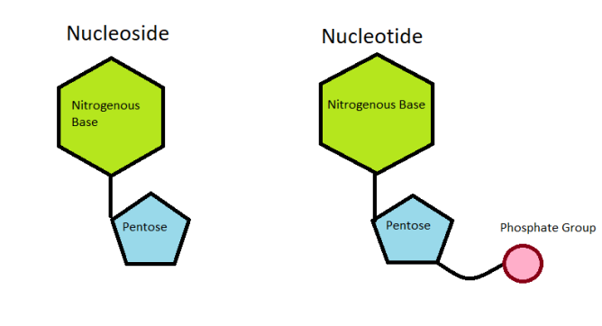

# INTRO

## What is a protein?
- a protein is a large molecule composed of one or more chains of amino acids in a specific order

## What is DNA?
- carries genetic instructions in all living things
- DNA is a long molecule made up of nucleotides
    - 

## What is a gene?
- a gene is a sequence of DNA that contains the instructions to make at least one protein

## What is a genome?
- the complete set of genes or genetic material present in a cell or organism

## What is a chromosome?
- a chromosome is a long DNA molecule with part or all of the genetic material of an organism
- humans have 23 pairs of chromosomes

## What is a cell?
- a cell is the smallest unit of life

## What are Histones and Nucleosomes?
- Histones are proteins that help organize DNA into a compact structure called a nucleosome
- Nucleosomes are a wrapped DNA around a core of histone proteins
    - 

## DNA vs RNA
- DNA is a double-stranded molecule
- RNA is a single-stranded molecule
- SUGAR
    - DNA has deoxyribose
    - RNA has ribose
    - 

## What is a Pentose?
- a pentose is a monosaccharide with five carbon atoms

## DNA Bases
- Adenine (A) 
- Thymine (T)
- Cytosine (C)
- Guanine (G)

## Nucleoside vs Nucleotide
- Nucleoside: base + sugar
- Nucleotide: base + sugar + phosphate
    - 
    
## DNA Bonds
- Hydrogen bonds
    - A-T: 2 hydrogen bonds
    - C-G: 3 hydrogen bonds

## What are Enzymes?
- Enzymes are proteins that act as biological catalysts
- Enzymes speed up chemical reactions in cells

## Antiparallel DNA
- Double helix
    - 
- One strand runs 5' to 3'
- The other strand runs 3' to 5'
- The result is antiparallel DNA

## Watson and Crick model
- They have proposed the double helix structure of DNA

## X-Ray Diffraction
- Rosalind Franklin and Maurice Wilkins used X-ray diffraction to study DNA structure
- They have discovered the helical structure of DNA

## Complementary Base Pairing
- Allows semi-conservative replication
- A-T and C-G are complementary base pairs

## Mitosis
- Mitosis is a process of cell division that results in two genetically identical daughter cells
    - 
    - DNA Replication: Doubling the genetic material for the daughter cells

## Process of DNA Replication
- DNA replication is the process of producing two identical replicas from one original DNA molecule
    - 
    - Free necleotides come from external sources: food, water, etc
    - DNA polymerase is the enzyme that synthesizes DNA molecules

    - DNA replication is semiconservative
        - Semi-conservative replication means that each new DNA molecule consists of one new strand and one old strand
        - 
            - The bottom strand is the old strand
            - The top strand is the new strand coming from the free nucleotides

## Overview: DOGMA of Molecular Biology
- DNA -> RNA -> Protein
    - 
        - DNA: contains the genetic information
        - RNA: carries the genetic information
        - Protein: long chains of amino acids
    - DNA: Transcription -> RNA -> Translation -> Protein
        - Transcription: DNA -> RNA
        - Translation: RNA -> Protein

## What are Ribosomes?

## What are Amino Acids?
- Amino acids are the building blocks of proteins
- There are 20 different amino acids
- They come from the food we eat

## What is a Codon?
- A codon is a sequence of three nucleotides that form a unit of genetic code in a DNA or RNA molecule
    - Example: AUG, GCC, etc
    - 
    - Genetic code is: Degenerate

## Exercice
    - Convert the following DNA sequence into RNA and then into a protein
        - DNA: ATGCGTACG
        - RNA: UAC GCA UGC
        - Protein: Tyr-Arg-Ala

        - DNA: TAC TTG TTT ACA TAA CTT TGA ATT_
        - RNA: AUG AAC AAA UGU AUU GAA ACU UAA_
        - Protein: Met-Asn-Lys-Cys-Ile-Glu-Thr-Stop
    
    - DNA to RNA:
        - T pairs with A
        - A pairs with U
        - G pairs with C
        - C pairs with G
     
    - RNA to Protein:
        - Use the circle and go from the inside to the outside
