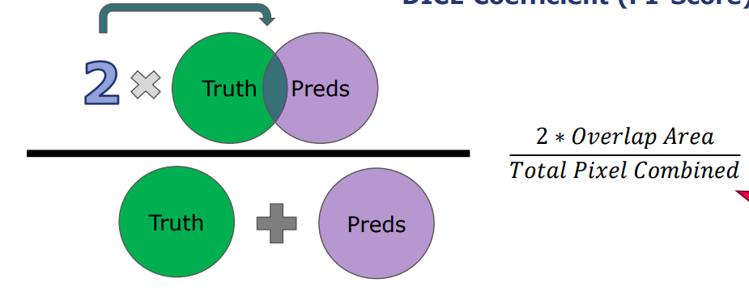
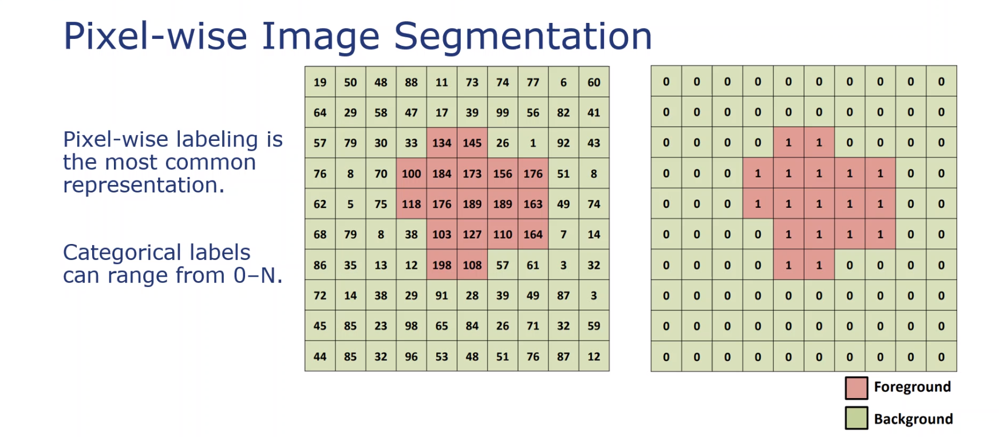
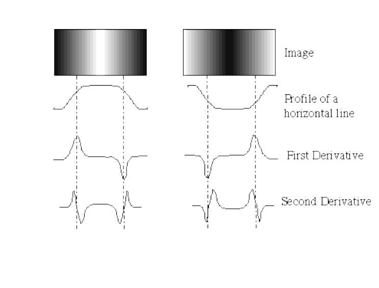
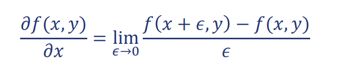
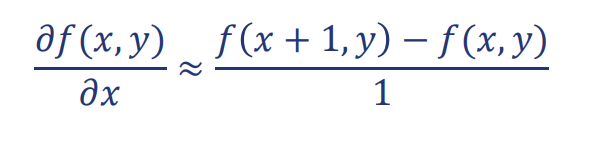
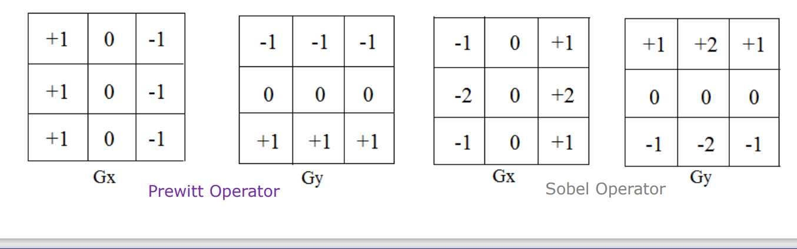
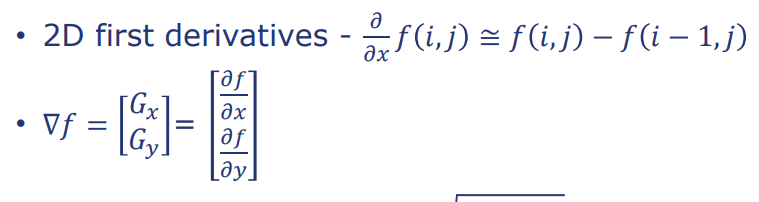
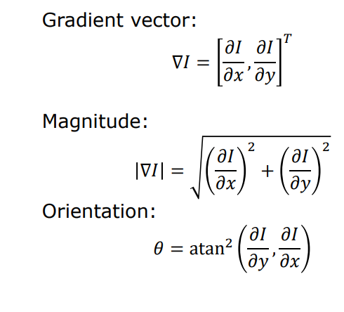
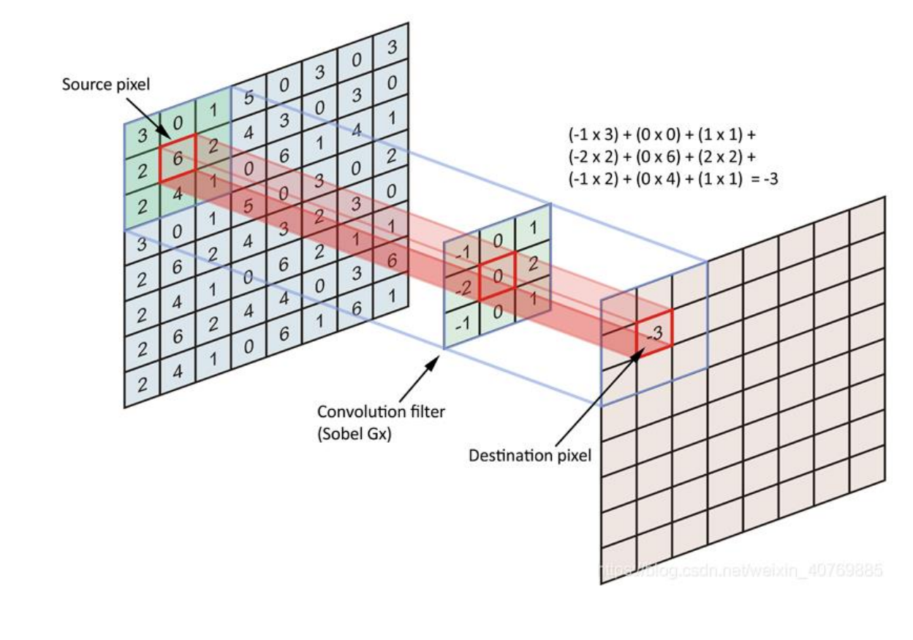
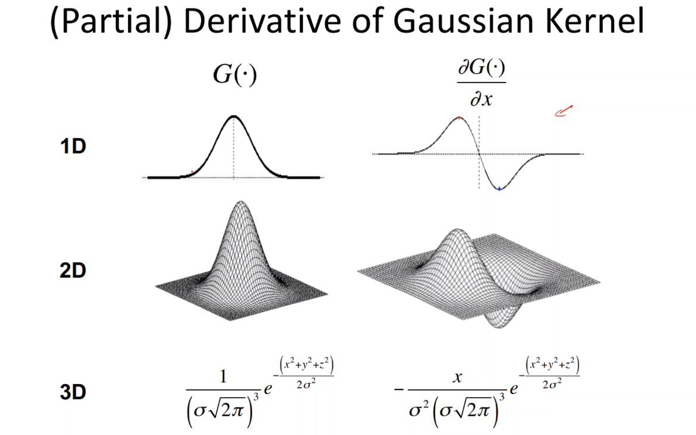

# Types of classification
- Binary classification
- Multi-class classification

## Multi-class classification vs Multi-label classification
- Multi-class classification: Each sample belongs to one and only one class
- Multi-label classification: Each sample can belong to multiple classes

## Segmentation
- Each pixel is classified as a class

## Is Segmentation a classification problem or a regression problem?
- It is a classification problem
- It is a regression problem
- It is clustering problem

## Steps in ML Modelling
- Define the problem
- Collect the data
- Look at the data and explore it
- Decide on the evaluation metric 
 - Classification: Accuracy, Precision, Recall, F1-score, AUC-ROC
 - Regression: Mean Squared Error, Mean Absolute Error, R2 score
 - Clustering: Silhouette score
 - Segmentation
   - Confusion matrix

- Define Features
 - Feature Engineering 
- Split the data into training and testing: Cross-validation
- Train the model
- Evaluate the model
- Tune the model based on Hyperparameters 
- Make predictions  

## Loss functions
- Impurity/Gini Index

## MCC (Matthews Correlation Coefficient)
- IS great for imbalanced datasets
- Takes into account True Positives, True Negatives, False Positives, False Negatives
- Ranges from -1 to 1
- Example 
 
 - Table of Predictions
   - True Positives: 10
   - True Negatives: 20
   - False Positives: 5
   - False Negatives: 5

  - MCC = (10*20 - 5*5) / sqrt((10+5)(10+5)(20+5)(20+5)) = 0.6

## DICE Coefficient
- Mostly used in segmentation
- Used in segmentation
- 2 * (Intersection of Predicted and True) / (Area of Predicted + Area of True)
- 
- Problem: 

## Jaccard Index
- Used in segmentation
- Intersection of Predicted and True / Union of Predicted and True
- IOU = Overlap / Union

## Segmentation - Pixel-wise categorial labels
- Each pixel is classified as a class
- Example: 
  - Image of a person
  - Each pixel is classified as a class
  - Person, Background, Sky, Tree, Car, Road, Building, etc

- 

## Segmentation Methods
- Random Taxonomy
  - Based on the global knowledge:
     - Histogram-based thresholding
     

  - Edge-based segmentation: Filters

  - Region-based segmentation: 
      - KNN: K-nearest neighbours
      - GMM: Gaussian Mixture Model
          - GMM is a type of model which is used to represent the probability distribution of a random variable
      
  - Combination of the above methods
      - Edge-based + Region-based

## Gaussian kernel
- Used in GMM

## Edge Detection
  -  Edges: Boundary (steep-changes) between two regions 
with distinct gray-level properties.
 - WIll use differentiation to detect edges
- Steepness is defined by spatial derivative:
  - 
- Derivatives with the convolution operation
  - For 2D function, 𝑓(𝑥, 𝑦), the partial derivative is:
    Equation: 
  

  - For discrete data, we can approximate using finite differences:
    Equation:
    

- Concept: Calculate the gradient to each pixel in order to detect the edges

## Derivatives Approximation with Kernel Operations
- Robert’s Cross Operator
- Pre-witt Operator
- Sobel Operator

## Gradient Operators
- 2D first order derivative operators

- Gradient magnitude: delta f: sqrt((delta f_x)^2 + (delta f_y)^2)
- Gradient direction: tan-1(delta f_y / delta f_x)

## Edge Strength
- Given by the gradient magnitude of the image
- Formula: sqrt((delta f_x)^2 + (delta f_y)^2)

- 

## How do the convolution operations work?
- 

## Edge Detection - Laplacian of Gaussian (LoG)
- LoG is a second derivative operator
- Sum of the second derivatives of the image
- Does not provide the direction of the edge but only the strength
- Very sensitive to noise
  - Apply Gaussian filter to the image before applying LoG
  - Or a Laplacian of Gaussian filter combined: As Gaussian filter is a low-pass filter, it will remove the high-frequency noise and then apply the Laplacian filter to detect the edges in the image

## Derivative of Gaussian
  - 

## Canny Edge Detection: Best Edge Detection Algorithm
- Multi-stage algorithm
- Noise reduction with Gaussian filter
- Edge detection with Sobel operator
- Convolving the image with the derivative of Gaussian
- Find the gradient magnitude 
- Find Gradient orientation
-  Compute Laplacian to find the edges
 
### Hysteresis Thresholding
- Global thresholding: 
  - Thresholding the gradient magnitude
- Regional thresholding:
  - Hysteresis thresholding
    - Two thresholds: High and Low
    - If the gradient magnitude is greater than the high threshold, it is considered as an edge
    - If the gradient magnitude is less than the low threshold, it is not considered as an edge
    - If the gradient magnitude is between the high and low threshold, it is considered as an edge if it is connected to a pixel that is greater than the high threshold

- Parameters to Canney Edge Detection
  - Sigma: Standard deviation of the Gaussian filter
  - High threshold
  - Low threshold
  - Kernel size: Size of the Sobel operator
  - Operator: eg. Sobel, Prewitt, etc
  

# Takeaways
### There are many different segmentation methods
- Thresholding
- Region Growing
- ML-Based
- And even more is coming up soon:
  - Level-sets, 
  - Fast-Marching, 
  - Graph-based
### Edge Detection
- Can produce disconnected boundaries
- Over/Under Segmentation
- Harder in 3D
- Canny smooths before applying gradients
### No one algorithm is the “best”.
- Must match to the problem and data