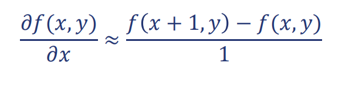
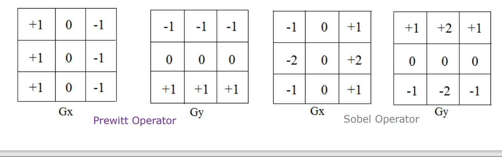
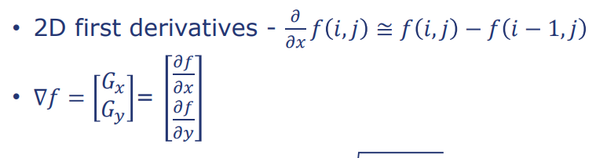
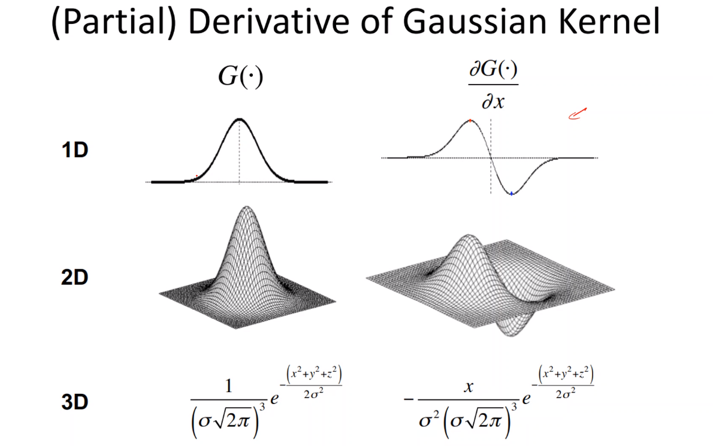

# Notes: ## Gaussian kernel
- Used in GMM

## Edge Detection
  -  Edges: Boundary (steep-changes) between two regions 
with distinct gray-level properties.
 - WIll use differentiation to detect edges
- Steepness is defined by spatial derivative:
  - 
- Derivatives with the convolution operation
  - For 2D function, 𝑓(𝑥, 𝑦), the partial derivative is:
    Equation: 
  

  - For discrete data, we can approximate using finite differences:
    Equation:
    

- Concept: Calculate the gradient to each pixel in order to detect the edges

## Derivatives Approximation with Kernel Operations
- Robert’s Cross Operator
- Pre-witt Operator
- Sobel Operator

## Gradient Operators
- 2D first order derivative operators

- Gradient magnitude: delta f: sqrt((delta f_x)^2 + (delta f_y)^2)
- Gradient direction: tan-1(delta f_y / delta f_x)

## Edge Strength
- Given by the gradient magnitude of the image
- Formula: sqrt((delta f_x)^2 + (delta f_y)^2)

- 

## How do the convolution operations work?
- 

## Edge Detection - Laplacian of Gaussian (LoG)
- LoG is a second derivative operator
- Sum of the second derivatives of the image
- Does not provide the direction of the edge but only the strength
- Very sensitive to noise
  - Apply Gaussian filter to the image before applying LoG
  - Or a Laplacian of Gaussian filter combined: As Gaussian filter is a low-pass filter, it will remove the high-frequency noise and then apply the Laplacian filter to detect the edges in the image

## Derivative of Gaussian
  - 

## Canny Edge Detection: Best Edge Detection Algorithm
- Multi-stage algorithm
- Noise reduction with Gaussian filter
- Edge detection with Sobel operator
- Convolving the image with the derivative of Gaussian
- Find the gradient magnitude 
- Find Gradient orientation
-  Compute Laplacian to find the edges
 
### Hysteresis Thresholding
- Global thresholding: 
  - Thresholding the gradient magnitude
- Regional thresholding:
  - Hysteresis thresholding
    - Two thresholds: High and Low
    - If the gradient magnitude is greater than the high threshold, it is considered as an edge
    - If the gradient magnitude is less than the low threshold, it is not considered as an edge
    - If the gradient magnitude is between the high and low threshold, it is considered as an edge if it is connected to a pixel that is greater than the high threshold

- Parameters to Canney Edge Detection
  - Sigma: Standard deviation of the Gaussian filter
  - High threshold
  - Low threshold
  - Kernel size: Size of the Sobel operator
  - Operator: eg. Sobel, Prewitt, etc
  

# Takeaways
### There are many different segmentation methods
- Thresholding
- Region Growing
- ML-Based
- And even more is coming up soon:
  - Level-sets, 
  - Fast-Marching, 
  - Graph-based
### Edge Detection
- Can produce disconnected boundaries
- Over/Under Segmentation
- Harder in 3D
- Canny smooths before applying gradients
### No one algorithm is the “best”.
- Must match to the problem and data

# Article about the lecture: 

## Title: Edge Detection & Kernels & Filters in Computer Vision
- This is a medium article that explains the concept of edge detection and filtering in computer science with mathematical explanation and code examples in Python.

### Introduction
- What is edge detection and filtering in computer vision? Why is it important? How is it done? This article explains the concepts of edge detection and filtering in computer vision.

### What is a Kernel?
- Kernel is a 2 parameter function that is represented as a matrix. It is used to perform operations such as convolution, filtering, and edge detection. The Kernel is used to apply a type of operation to the image creating a new output image. The kernel is applied to the image by sliding the kernel over the image and performing the operation at each pixel.

### What is Edge Detection?
- Edge detection is the process of identifying the boundaries of objects in an image while ensuring that the edges are precise and accurate. It is a critical step in image processing and computer vision as it allows the computer to understand the structure of the image and identify objects.

## Kernel Operations
- As mentioned earlier, the kernel is used to perform various different operations on the image. Convolution is one of the most common operations performed using the kernel. This operation is used to apply the kernel to the image and create a new output image. In the following section an example of how to perform convolution using a kernel is given.

____________

IMAGE

____________

As in the frist step we can see a preselected 2x2 frame from the Input has been taken. This part of the Input image is then multiplied with the kernel in the second step. The result of the multiplication is then added together to get the final output. This process is repeated for every pixel in the image to get the final output image.
Explanation of Output Image

0*0 + 1*1 + 3*2 + 4*3 = 0 + 1 + 6 + 12 = 19 

## Gaussian Kernel
- The Gaussian kernel is a type of kernel that is used to perform a concept called Gaussian blur. This concept is used to reduce the noise in the image and make the edges of the image smoother. The Gaussian kernel is 3x3 matrix with the following values:

____________

IMAGE

____________

This kernel is approximately equal to the following 2D Gaussian function:

h(v, u) = 1/16 * [[1, 2, 1], [2, 4, 2], [1, 2, 1]]

h(v, u) = 1/ (2 * pi * sigma^2) * e^(-((v^2 + u^2) / (2 * sigma^2)))

Very important to note that the Gaussian kernel is used to focus on hyperparameter tuning as by in depth understanding of the parameters we can get the best results. The parameters are:
- Kernel size: Determines the range the smoothing will be applied to
- Variance: Determines the amount of smoothing that will be applied to the image

On the following images we can see the difference on how important the parameters are:

____________

IMAGE

____________

By increaseing the kernel size we can see that the focal point of the image is getting smaller and smaller. This is due to the fact that larger kernel size gives the function a larger range to apply the smoothing to and therefore the focal point being more precise. The variance (sigma) acts as a smoothing factor. The larger the variance the more smoothing will be applied to the image. The smaller the variance the less smoothing will be applied to the image.

## Edge Detection by derivatives
- Premise: What is an edge? Edge is a violent change in the intensity of 2 pixels next to each other. Based on this premise we can calculate the gradient to each pixel. By applying the logic of violant change in intensity we can assume that edge is therefore located where the gradient is large. On the following image we can see the intensity function along the horizontal scanline of the image. We can naturally see a valley in the middle of the image representing different intensity of the pixels.

____________

IMAGE

____________

In the next step we are going to apply a first derivate in order to detect extreme gradients, in other words, edges. The first derivative is calculated by the following formula:

On this image we can cleary see the 2 peaks that represent the edges of the image. The first peak represents the left edge and the second peak represents the right edge of the image. As we can see the area in between the 2 peaks is a flat line in the same height as the line before the first peak and after the second peak. One might be confused by this fact in comparison to the intensity plot. The first derivative has nothing to do with the intensity of the pixels, it only detects the change in intensity. The black area is continuous and therefore the derivative line between the peaks is constant. Same for the area before and the edges. The edges are the only place where the intensity changes and therefore the derivative is the only place where the line is not constant.

## Derivatives with convolution operation kernels

The main concpet of this part is to calculate the gradient to each pixel in order to detect the edges. The 3 main type of finite differences are:
- Forward difference
- Backward difference
- Central difference

Each of them cakculates the derivative in a different way. The forward difference calculates the derivative by taking the difference between the current pixel and the next pixel. 
The backward difference calculates the derivative by taking the difference between the current pixel and the previous pixel.
The central difference calculates the derivative by taking the difference between the next and the previous pixel. The central difference is the most accurate way of calculating the derivative as it takes into account the next and the previous pixel. The forward and backward difference only take into account the next or the previous pixel and therefore are not as accurate as the central difference.

## Derivatives Approximation with Kernel Operations

The study of the derivatives approximation with kernel operations is a very important part of the edge detection process. The 3 most common operators are:
- Robert’s Cross Operator
- Pre-witt Operator
- Sobel Operator

Each of these operators is based on a different kernels. In each operator 2 kernels are used. The first kernel is used to calculate the derivative in the x direction and the second kernel is used to calculate the derivative in the y direction. 

The 2 kernels are both applied to the image to calcullate the output image. Each of the output images is then combined to get the final output image using the formula:
L2 = sqrt(Gx^2 + Gy^2)

## Edge Strength
As mentioned earlier, the edge strength is given by the gradient magnitude of the image. The gradient magnitude is calculated by the following formula:
delta f = sqrt((delta f_x)^2 + (delta f_y)^2)

## Canney Edge Detection 
Multi-stage algorithm which is composed of the following steps:

## Edge Detection - Laplacian of Gaussian (LoG)
LoG is a second derivative operator which which is a sum of the second derivatives of the image. It does not provide the direction of the edge but only the strength. It is very sensitive to noise and therefore it is recommended to apply a Gaussian filter to the image before applying LoG. Another option is to apply a Laplacian of Gaussian filter combined. As the Gaussian filter is a low-pass filter, it will remove the high-frequency noise and then apply the Laplacian filter to detect the edges in the image.

## Derivative of Gaussian
Is a concept which allows us to make the Gaussian filter more precise. The Gaussian filter is a low-pass filter and therefore it removes the high-frequency noise. The Derivative of Gaussian filter is a high-pass filter and therefore it removes the low-frequency noise. By combining the 2 filters we can get a very precise edge detection.

## Hysteresis Thresholding
Hysteresis thresholding is a method used to threshold the gradient magnitude. It is composed of 2 thresholds: High and Low. If the gradient magnitude is greater than the high threshold, it is considered as an edge. If the gradient magnitude is less than the low threshold, it is not considered as an edge. If the gradient magnitude is between the high and low threshold, it is considered as an edge if it is connected to a pixel that is greater than the high threshold.

## Conclusion
Edge detection and filtering are important concepts in computer vision. They are used to identify the boundaries of objects in an image and reduce the noise in the image. The Gaussian kernel is used to perform Gaussian blur and reduce the noise in the image. The edge detection is done by calculating the gradient to each pixel and applying the concept of violent change in intensity. The derivative of Gaussian filter is used to make the Gaussian filter more precise. The Canny edge detection is a multi-stage algorithm that is used to detect the edges in the image. The hysteresis thresholding is used to threshold the gradient magnitude and identify the edges in the image.

## Conclusion to the article
This article looks in depth into the concept of edge detection and filtering in computer vision. It explains the concept of edge detection and filtering and how it is done. It also explains the concept of the kernel and how it is used to perform operations such as convolution, filtering, and edge detection. The article also provides mathematical explanations into concepts like the Gaussian kernel and the concept of using the derivatives to determine values like the gradient magnitude, direction, and end edge strength. In addition to the mathematical explanations a real plots and images are provided to give a visual representation of the concepts and their hyperparameter tuning. 

At the conclusion of the article, I would like to thank Mr. Liad Magen for his guidance and provision of materials explaining the discussed topics. His expertise and support have been instrumental in enriching the content and insights presented.