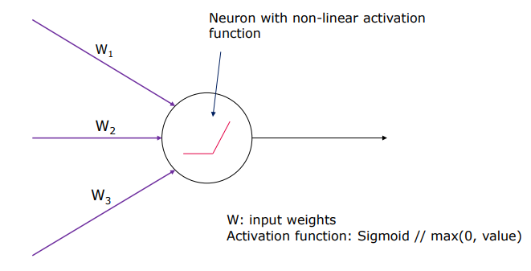
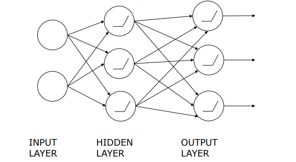
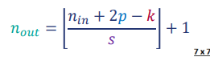
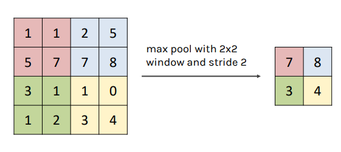

# Lecture 3: Neural Networks - Depp Learning

## PCA
- Reduces the dimensionality of the data

## UMAP
- It is a dimensionality reduction technique

##  Neural Networks

Inputs: A set of features
Outputs: A set of predictions
Weights: A set of parameters that are learned from the data
Loss function: A function that measures how well the model is doing
Optimization: A process of finding the best set of weights

## Concept: 

Non-linear function is used to transform the input to the output
Non linear because we want to capture the non-linear relationships in the data
    - ReLU: Rectified Linear Unit
    - Sigmoid
    - Tanh
    - Softmax

## Architecture

- Input Layer
- Hidden Layer
- Output Layer

- Verifying the quality and adjusting the weights: Backpropagation
- Learning rate: How much to adjust the weights
- Epochs: How many times to go through the data
- Input size: 
    - for classification: Number of features
    - for segmentation: Number of pixels

## Error calculation
- Calclates the distance beween the network's output and the true output
- Each typ eof problem has a different error calculation
    - Mean Squared Error (MSE) – regression
    - Binary Cross Entropy – binary classification
    - Categorical Cross Entropy Loss – multiclass (one-hot-vectors)
    - Negative Log-Likelihood loss – multiclass
    - Multilabel margin loss – multilabel
    - Dice Coefficient – segmentation
    - Jaccard Index – segmentation  

## CNN (Convolutional Neural Networks)
- Used for image data
- Convolutional layers are used to extract features from the image
- The layers are not fully connected
- Filters are used to extract features from the image (edges, textures, etc.)
- Each 2D slice of the filters are called kernel
- Convolutional layers are followed by pooling layers
- Convolutions is a process of applying a filter to an image

### Key characteristics of CNN
- They learn hierarchical representations of the data
- Preserve a spatial relationship between pixels

### Size of input X size of filter
- The size of the input * the size of the filter will give the size of the output
- Input size: 5x5 Filter size: 3x3 Output size: 3x3

### Padding 
- Concpet which is used to preserve the spatial dimensions of the input volume
- It is used to add zeros to the input volume so that the output volume has the same dimensions as the input volume

### Stride
- The number of pixels by which the filter is moved

n(out) = (n(in) - 2p - k)/s + 1

- n(out) = output size
- n(in) = input size
- p = padding
- k = filter size
- s = stride

### Feature Maps
- The output of the convolutional layer is called a feature map
- The number of feature maps is equal to the number of filters used in the convolutional layer

### Filter Convolutions
- Filters convolve with the 3D input volume to produce 2D output feature maps
- When Using multiple filters, the output will be a 3D output with one 2D feature map per filter

### Activation Function
- ReLU
- Sigmoid
- Tanh
- Softmax

- ReLU is the most commonly used activation function.
- Sigmoid is not good as it can cause the vanishing gradient problem

## Recap
• A convolutional layer convolves each of 
its filters with the input.
• Input -
• a 3D tensor: Width × Height ×
Channels (or Feature Maps)
• Output -
• a 3D tensor: Width × Height × Feature 
Maps (one for each filter)
• Applies non-linear activation function 
(usually ReLU) over each value of the 
output.

Multiple (hyper)parameters to be 
defined: 
• # of filters
• Filters size
• Stride
• Padding
• Activation function
• Regularization.

## Pooling
- Pooling layers are used to reduce the spatial dimensions of the input volume

- Min Pooling / Max Pooling / Average Pooling = Takes one of the segments and applies the function to it to pick the chosen value

## Full Convolutional Network
- Input
- Convolutional Layer 1
- Pooling Layer 1
- Convolutional Layer 2
- Pooling Layer 2
- Fully Connected Layer
- Output

## Convolutional Layers
### Action
- Apply filters to extract features from the input
- The filters are composed of small kernels which are learned 
- One bias term per filter
- Applying the activation function on every value of feature map

## Why do we use log loss?
- When the output is 0, the log loss is infinity
- When the output is 1, the log loss is 0

## What do CNN layers learn?
- The first layer learns simple features and basic details
- The middle layers learn more complex features and parts of the image (eyes, nose, etc.)
- The last layers learn to recognize full objects in different orientations and shapes

## Backpropagation
- Tells us how to adjust the weights in order to minimize the error of the network and improve the predictions
- The weights are adjusted in the opposite direction of the gradient of the loss function

## Layer's Reception Field
- The receptive field is the region in the input space 
that a particular CNN’s feature is looking at 
(i.e. is affected by).
- A layer's receptive field refers to the spatial region in the input data that influences the activations of neurons within that layer, typically expanding with each layer in a convolutional neural network as a result of successive convolution and pooling operations.

## Loss Function
### L1 distance
- Absolute difference between the true value and the predicted value
- L1 loss is less sensitive to outliers
### L2 distance
- Squared difference between the true value and the predicted value
- L2 loss is showing the outliers more than L1 loss

## Optimization 
- Partial Derivatives: The derivative of a function with respect to one of its variables, with the others held constant
-  SGD: Stochastic Gradient Descent
-  Adam: Adaptive Moment Estimation 

## Softmax
- Used for multi-class classification
- It converts the output to a range of 0 to 1
- The sum of the outputs is equal to 1
- Used to calculate the relative probabilities of the classes
- The one with the highest rate is the predicted class

- Works on the formula:
    - y = e^x / sum(e^x)
    - e^x is the exponential of x
    - sum(e^x) is the sum of the exponentials of all the classes
    - y is the probability of the class
    - x is the output of the network

## Multi label vs Multi class
- Multi label: Each sample can belong to multiple classes
- Multi class: Each sample belongs to one and only one class
- Example: 
    - Multi label: Car can be red, fast, and expensive
    - Multi class: Car can be red, blue, or green

## How to prevent overfitting
- Regularization
- Early stopping

## Batch Normalization
- Batch: A set of samples that are processed together
- Normalization: Scaling the input to have a mean of 0 and a standard deviation of 1
- Normalization is done for each feature in the input

## Gradient Accumulation
- Collects the gradients from multiple batches before updating the weights

## Model distillation
- Training a smaller model to mimic the predictions of a larger model
- The smaller model is trained on the outputs of the larger model
- The smaller network generalizes better than the larger network and is faster to train

# Article about the lecture: 

## Title: Neural Networks - Deep Learning

## Introduction
- Neural Networks are the foundation of deep learning popularized by the rise of big data and computational power. They are used in a wide range of applications such as computer vision, natural language processing, and speech recognition. This article will dive into the concepts of neural networks like: their fundamental building blocks, the architecture, the error calculation, the optimization process or the activation functions.

## What are the fundamental building blocks of a Neural Network?
The Neuron. Neuron (Perceptron) is composed of a weights, a bias, and a non-linear activation function. The mathematical representation of a neuron is: 
    - y = f(w1x1 + w2x2 + ... + wnxn + b)
    - y is the output
    - f is the activation function
    - w1, w2, ..., wn are the weights
    - x1, x2, ..., xn are the inputs
    - b is the bias

## What is a Neural Network?
A neural network is a set of algorithms resembling the human brain. It is composed from a set of inputs, a set of layers, and a set of outputs. Each layer is composed of a set of neurons. The neurons are connected to each other by a set of weights. Each of these weights is representing a parameter that is learned from the data. Neural network is an unsupervised learning algorithm, which means that it learns from the data that is not labeled. This means that the network is learning to find patterns in the data by itself instead of being told what to look for. This leads to the network being "creative" and finding patterns that are not obvious to the human eye. This feature of being able to find complex patterns in the data is what makes neural networks so powerful however, it also makes them hard to interpret and compute. 

### Architecture of the Neural Network
The architecture of a neural network is composed of three main layers: 
    - Input Layer
    - Hidden Layer
    - Output Layer

As can be seen on the listed figure each of the layers are interconnected with each other via a set of weights. The input layer is the first layer of the network and it is composed of a set of features. The hidden layer is the layer that is responsible for learning the patterns in the data. The output layer is the layer that is responsible for making the predictions. The number of inputs is defined by the number of features in the data. The number of outputs is defined by the number of classes in the data which we want to predict. Each of the neurons inside the hidden layer and output layer have its own activation function calculating the output of the neuron. 

## Activation Functions
The activation function as already mentioned is a non-linear function that is used to transform the input to the output. 

The most commonly used activation functions are: 
    - ReLU: Rectified Linear Unit
    - Sigmoid
    - Softmax

Each of these activation functions have their own use case and their own advantages and disadvantages. ReLU is the most commonly used activation function. It is used to capture the non-linear relationships in the data. Sigmoid is used for binary classification. Sigmoid is heavily overused and the fact it can cause the vanishing gradient problem is completely ignored. The vanishing gradient problem is a problem that occurs when the gradient of the loss function becomes very small meaning that the network has a very minimal chance of learning anything. Softmax is used for multi-class classification. It works on the premise of normalizing the output to a range of 0 to 1. The total sum of the outputs always equals 1 as it represents the "probability" of the class. This "probability" shall not be confused with the actual probability determined by the data. The use of the word "probability" is used to represent the relative probabilities of the classes.

## Error Calculation
The main concept of the error calculation is to calculate the distance between the network's output and the true output. Each type of problem has a different error calculation. For example, for regression problems the Mean Squared Error (MSE) is used. For binary classification problems the Binary Cross Entropy is used. For multi-class classification problems the Categorical Cross Entropy Loss is used. For multi-label classification problems the Multilabel margin loss is used. For segmentation problems the Dice Coefficient is used. For segmentation problems the Jaccard Index is used.

## Convolutional Neural Networks (CNN)
Convolutional Neural Networks are used for image data. They are composed of a set of convolutional layers and pooling layers. The convolutional layers are used to extract features from the image. The layers are not fully connected. Filters are used to extract features from the image such as edges, textures, etc. Each 2D slice of the filters are called a kernel. Convolutional layers are followed by pooling layers

---------------

image

---------------

As can be seen on the listed figure the Convolutional Network is combined of set of different layers. The input layer is the first layer of the network. The rule of thumb is that the input size is equal to the number of pixels in the image. The following layer is the convolutional layer. The convolutional layer is responsible for applying filters to the input to extract features from the image. The output of the convolutional layer is called a feature map. The number of feature maps is equal to the number of filters used in the convolutional layer. These feature maps are storing the features that are extracted from the image. The next layer is the pooling layer. The pooling layer can be compared to the activation function in the sense that it is responsible for modifying the output of the previous layer in a constant fashion. The availabe pooling functions are: Min Pooling, Max Pooling, and Average Pooling. The pooling layer is used to reduce the spatial dimensions of the input volume. The output of the pooling layer is a reduced version of the input volume. The last layer is the fully connected layer. The fully connected layer is responsible for actually making the predictions. The fully connected layer is connected to the output layer. Based on the output of the fully connected layer the network is assigning the class to the image.

### Padding
Concept of padding comes from the idea of preserving the spatial dimensions of the input volume as by default the convolutional layer is reducing the spatial dimensions of the input volume by applying the filter to the input which changes the dimensions of the input. The main premise of the padding is to add zeros to the input volume so that the output volume has the same dimensions as the input volume. This allows us to have the same dimensions of the input and the output volume.
- Full padding adds a border of zeros such taht all image pixels are visited the same number of times by the filter. Increasing the padding increases the size of the output volume. 
- Same padding adds a border of zeros such that the output volume has the same dimensions as the input volume.

### Stride
The stride is a "Measuring Window" size. It controls the magnitude of how much is the respective filter moved each time. The stride is used to control the output size of the volume. This is based on the principle that the output size is calculated by the 
formula: n(out) = (n(in) - 2p - k)/s + 1. 
The n(out) is the output size
n(in) is the input size
p is the padding
k is the filter size
s is the stride

### Convolutional Layers
The Actions:
    - Apply filters to extract features from the input
    - The filters are composed of small kernels which are learned
    - One bias term per filter
    - Applying the activation function on every value of feature map

Parameters:
    - Number of Kernels
    - Kernel Size D, H, W is defined by the input tensor
    - Stride
    - Padding
    - Regularization

Input & Output:
    - Input: 3D tensor: Width × Height × Channels 
    - Output: 3D tensor: Width × Height × Feature Maps (one for each filter)
            : 2D Feature Map per filter

### Pooling
The Actions:
    -  Reduce the spatial dimensions of the input volume
    - Sliding a window over the input and applying a function to it

Parameters:
    - Pooling Type: Min, Max, Average
    - Pooling Size: D, H, W
    - Stride
    - Padding

Input & Output:
    - Input: 3D tensor: Width × Height × Channels (or Feature Maps)
    - Output: 3D tensor: Width × Height × Channels (or Feature Maps)
            : 2D Feature Map per filter 
            : Reduced spatial dimensions

### Full Convolutional Network
The Action:
    - Collect the information from the final feature map
    - Generate the final output (prediction)

The Parameters:
    - Number of Nodes
    - Activation Function

Input & Output:
    - Input: Flattened 3D tensor 
    - Output: 3D tensor: Width × Height × Channels
            : 2D Feature Map per filter 

## Success evolution through the layers
The evolution of the outcome is improved over the hidden layers. There would not be a significant reason to keep extending the number internal layers if the network is not learning anything new. The first layer learns simple features and basic details. The middle layers learn more complex features and parts of the image (eyes, nose, etc.). The last layers learn to recognize full objects in different orientations and shapes.
This evolution is the reason why the convolutional neural networks are so powerful. They are able to propagate the information from the input to the output in a way that the network is able to learn the patterns in the data.

## Backpropagation
In order to imrove over time the Neural Network use a concept of Backpropagation. The backpropagation is a process that tells us how to adjust the weights in order to minimize the error of the network and improve the predictions 

---------------

image

---------------

The next figure is showing us a real example on how the backpropagation is working. The data we are working with is the output of convolutional layer to the pooling layer using the max function. After successfully calculating the output of the pooling layer. We can see the error that is calculated by the network using backpropagation. Even tough we used the Max Pooling function the error is still calculated in the same way as it would be calculated if we used the Min Pooling or Average Pooling function. The magnitude of the error is represented with the color blue and the actual result of the Max Pooling function with a small red number in each of the cells of the output. This means that in order for us to get the best results the number calculated by the Max Pooling function should be as close as possible to the actual result and therefore our error should be as small as possible. Important thing to be noted is that backpropagation is used to calculate the error and not to calculate the output of the network. Its usage is also not a one-time thing. The backpropagation is used to calculate the error of the network every single time the network is making a prediction. This is the reason why the backpropagation is so important. The continuous usage of the backpropagation is what makes the network learn from the data and improve over time. 

## Model Distillation
The idea of having large models is a thrilling one. However, the large models are not always the best solution and often are not sustainable and achievable unless the computational power is not a problem. The large models are often slow to train and hard to interpret. They might introduce a lot of noise and potentially have learned occasional patterns that are not relevant to the test data. The model distillation is a process of creating a smaller model which is trained to mimic the predictions of a larger model. The key concept of the model distillation is that the smaller model is trained on the outputs of the larger model. This allows the smaller model to be trained very efficiently with already pre-processed data and observed patterns. The smaller model is able to generalize better due to the lack of noise and irrelevant patterns. The trainig time of smaller model is a fraction of the time needed to train the larger model. This allows the Machine Learning Engineers to save time, resources,  and observe new behvaiours of the model which is not influenced by the noise and irrelevant patterns.
